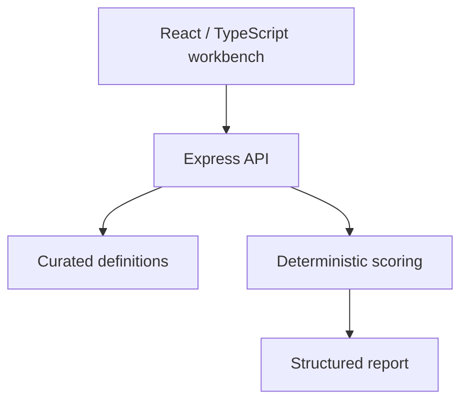
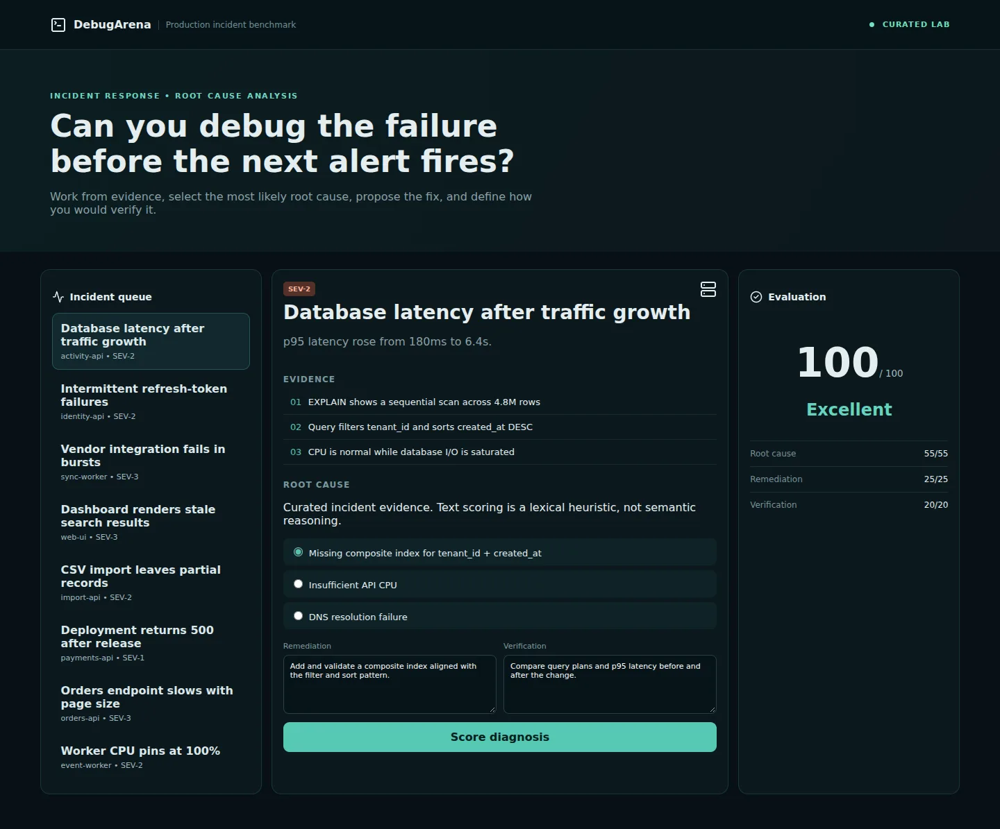

# DebugArena

An evidence-first production incident lab for practicing root cause analysis, remediation, and verification.

[](https://github.com/yeabsira-mesfin/debug-arena/actions)

**Demo status:** public hosting is pending account permissions. No live URL is claimed. Run the local demo below.

## Why this exists

Debugging unfamiliar systems requires connecting logs, telemetry, configuration changes, and code behavior. A multiple-choice diagnosis alone does not describe a safe recovery plan.

## Important features

- Eight curated incident scenarios: database indexing, token races, vendor rate limiting, stale React responses, partial imports, missing deployment secrets, N+1 queries, and retry loops.
- Incident queue, severity, service context, and log/telemetry evidence.
- Diagnosis plus written remediation and verification.
- Reference remediation is available only after submission, rather than leaked by the incident-list endpoint.
- Input validation and deterministic score generation.

## Architecture

The React client calls a stateless scoring API. Curated task/rule definitions and score policies live in the backend. Production requests use the same-origin API by default; local development defaults to the backend port. No database, credential, or paid AI API is needed.



## Technology stack

React, TypeScript, Vite, Node.js 22, Express, Node test runner, Docker, GitHub Actions.

## Evaluation methodology

The root-cause selection earns 55 points. Remediation earns 25 and verification earns 20 if each contains at least 20 characters and overlaps at least two distinct reference keywords of more than five characters (or all available keywords when fewer exist). Matching uses whole words.

This is an intentionally transparent **lexical heuristic**, not semantic grading. Keyword stuffing can game it, and valid paraphrases may receive no credit. The lab has no actual production telemetry or measured incident outcomes. Written rollback planning is useful practice but is not separately scored.

## Example

The database scenario supplies a sequential scan, a tenant filter plus descending timestamp order, and saturated database I/O. Select the composite-index diagnosis, explain an index aligned with the filter/sort, and propose query-plan and latency verification. The reference answer yields 100 by definition; this is fixture validation, not an engineer or model performance claim.

## Security considerations

- Submitted content is treated as data. There is no `eval`, shell execution of submissions, arbitrary repository checkout, or candidate code execution.
- Requests are bounded and validated; UI requests time out and surface errors.
- APIs are public, stateless demonstration endpoints. CORS permits configured origins, but CORS is not authentication. Configure `ALLOWED_ORIGINS` as a comma-separated list of exact frontend origins for cross-origin hosting.
- No secrets are required. `VITE_` variables are public bundle contents; use `VITE_API_BASE_URL` only for an API URL.
- Do not submit private code, customer data, or real credentials. The application does not intentionally persist submissions, but hosting providers can retain request/access metadata.
- Hosting-level rate limits and abuse controls are needed before wider public traffic. Future executable evaluation must use disposable, isolated environments with resource limits, restricted networking, and no production credentials. The ordinary application Dockerfiles are not an untrusted-code sandbox.

## Project structure

```text
frontend/src/App.tsx       Incident console
frontend/src/api.ts        API requests and timeouts
backend/src/incidents.ts   Curated incident registry
backend/src/scoring.ts     Lexical rubric
backend/src/server.ts      Validated Express API
backend/test/              Scoring and API tests
.github/workflows/ci.yml   Build and backend tests
vercel.json               Frontend/backend service routing
docker-compose.yml       Local same-origin demo
```

## Local setup

Requirements: Node.js 22, npm. Start backend and frontend in separate terminals.

```bash
cd backend
npm ci
npm run dev
```

```bash
cd frontend
npm ci
npm run dev
```

Open `http://localhost:5173`. The API listens at `http://localhost:8080`. If overriding the API location, copy `frontend/.env.example` to `frontend/.env.local` and set `VITE_API_BASE_URL`. Restart Vite after changing it.

For the same-origin Docker demo:

```bash
docker compose up --build
```

Open `http://localhost:5173`. Nginx proxies API requests to the backend and serves SPA deep links. Docker configuration is provided; consult the QA notes for whether a container build was actually run.

## Testing

```bash
cd frontend
npm ci
npm run build   # includes strict TypeScript checking
```

```bash
cd backend
npm test && npm run build
```

[QA notes](docs/QA.md) record actual checks and limitations. CI installs from committed npm lockfiles. Test results are software verification, not benchmark/model evaluation data.

## Deployment

**Vercel:** import this repository with the repository root selected. `vercel.json` defines the React frontend plus the existing backend as separate services. Services are currently Beta. The Java backend uses a container runtime; the other projects retain FastAPI or Express. API routes precede the frontend catch-all. Production defaults to a same-origin API, avoiding cross-origin configuration and localhost leakage. If deploying the frontend alone, select `frontend` as root and set `VITE_API_BASE_URL` to the deployed API origin before building.

**Alternative API hosting:** use the backend Dockerfile on a provider supporting that runtime, such as Render. Set `ALLOWED_ORIGINS` to the exact frontend URL and set the frontend public API origin. RepoDoctor accepts `PORT`; use the Dockerfile's documented port for Python/Node deployments or override the startup command.

**GitHub Pages:** Pages can host only the static React frontend, not Python/Node/Java APIs. A manual Pages workflow is included. Enable Pages with GitHub Actions in repository settings, configure repository variable `PUBLIC_API_BASE_URL` with the hosted API origin, and run the workflow. The build derives its base path from the repository name so renamed repositories retain working assets. Without a hosted API it cannot provide the interactive evaluator.

Free-tier terms are time-sensitive. Current official references: [Vercel Hobby](https://vercel.com/docs/plans/hobby), [Vercel Services pricing](https://vercel.com/docs/services/pricing), [Render free services](https://render.com/docs/free), and [GitHub Pages limits](https://docs.github.com/en/pages/getting-started-with-github-pages/github-pages-limits). Hobby has usage caps and personal/noncommercial restrictions. Render free web services have sleep/usage limits. No provider is claimed to be permanently free.

## Screenshots and demo

Actual screenshots from the production build running locally against its backend:



[Mobile screenshot](docs/screenshots/mobile.webp) · [QA notes](docs/QA.md)

These show curated fixture evaluations, not measured model performance. Public hosting remains pending.

## What this demonstrates professionally

Production debugging judgment, evidence-based diagnosis, API engineering, root cause analysis, remediation design, and explicit verification strategies.

## Limitations

Curated evidence is fictional. Lexical scoring is gameable and not a substitute for a human incident review. No real system is modified.

## Author

**Yeabsira Mesfin**
Full Stack Software Engineer · M.S. Cybersecurity in Computer Science student
